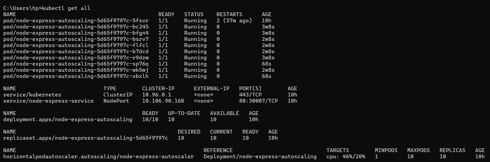

# Autoscaling Application with Kubernetes Experiment

This project demonstrates the setup of **Horizontal Pod Autoscaling (HPA)** in Kubernetes using an **Express.js** application. The deployment includes testing the application load using **Locust** and monitoring the autoscaling behavior based on CPU usage.

## Author
**`Roy Aziz Barera`**

## Description
This project leverages **Kubernetes Horizontal Pod Autoscaler (HPA)** to automatically scale the application pods based on CPU usage. The setup includes configuring a deployment and HPA YAML file, monitoring CPU metrics, and running a load test using **Locust** to evaluate the performance under stress.

## Resource
1. Docker Image
    ``` bash
      docker pull royazizbarera/node-express-autoscaling
    ```
2. Metrics Server
[Install Metric Server](https://youtu.be/JE4KTlNTjOM?si=Cdjvzj06dfHqP1Ha)

## Requirements
- Kubernetes Cluster (Minikube, Docker Desktop with Kubernetes, or managed Kubernetes)
- Metrics Server installed on the Kubernetes cluster
- **kubectl** installed on your machine
- **Locust** installed for load testing

## Running

1. **Apply Deployment and HPA Configuration**:
   Run the following commands to deploy the application and set up autoscaling:
```bash
    kubectl apply -f k8s/deployment.yaml
    kubectl apply -f k8s/hpa.yaml
```

## Command
**1. Verifying CPU Metrics**
``` bash
kubectl top pods
kubectl get hpa
```
**2. Run Locust Load Test**
``` bash
locust -f loadtest.py --host http://localhost:30007
```

# Load Testing with Locust
## Initial Condition


## Test 10 Users


## Test 50 Users


## Server Condition when 50 Users Requests




## Test 100 Users


## Back to 1 replicaset


# Autoscaling Performance Analysis

This section provides an overview of the load test results for the autoscaling setup.


## Key Highlights
1. **Request Handling**
  - The application successfully handled **6,190 requests** with a low failure rate (50 failures, **0.12 failures/sec**).
  - The average response time was **543 ms**, showing a stable request processing under load.

2. **Response Time**
  - **50th percentile** (median): **140 ms**, indicating that half of the requests were processed within 140 ms.
  - **95th percentile**: **2,100 ms**, meaning that 95% of the requests were completed in under 2,100 ms. The maximum response time peaked at **17 seconds**, which were rare outliers.

3. **Scaling Efficiency**
  - **Requests Per Second (RPS)** steadily increased, reaching up to **28.5 RPS** without any recorded failures during peak traffic.
  - This demonstrates that the autoscaler adapted efficiently to increasing load, maintaining service availability.

4. **User Load**
  - The system handled up to **100 concurrent users** effectively, with minimal degradation in performance.
  - The overall response time remained manageable, even with a high number of users.

## Conclusion

The autoscaling mechanism performed well, ensuring the application remained responsive and scaled appropriately to manage increased traffic. While a few isolated long response times were observed, the system maintained a low failure rate and processed requests efficiently under a high load scenario.
